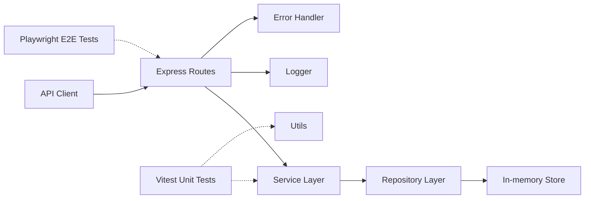

# AstroBookings Architectural Design Document

A backend API for managing rockets, launches, and future bookings for space travel.

### Table of Contents
- [Stack and tooling](#stack-and-tooling)
- [Systems Architecture](#systems-architecture)
- [Software Architecture](#software-architecture)
- [Architecture Decisions Record (ADR)](#architecture-decisions-record-adr)

## Stack and tooling

### Technology Stack
- Language: TypeScript 5.6
- Runtime: Node.js 22
- Framework: Express 4.21
- Data store: In-memory collections
- Testing: Playwright 1.58 (E2E), Vitest 4.0 (unit)
- Logging: Console logger with levels

### Development Tools
- Build: `tsc`
- Dev server: `tsx watch`
- Tests: `playwright test` (E2E), `vitest` (unit)
- Testing: Vitest 4.0, @vitest/coverage-v8 4.0
- Package manager: npm
- Linting: None configured
- Deployment: None configured

## Systems Architecture

AstroBookings is a stateless REST API that exposes endpoints for rockets and
launches. It validates inputs, enforces capacity rules, and returns structured
JSON responses. The system is designed for demo use with no persistence or
security layer.

## Software Architecture

The codebase follows a layered modular design.

- Routes define REST endpoints and delegate to services.
- Services implement business rules and orchestration.
- Repositories encapsulate data access for in-memory stores.
- Stores keep entity arrays and ids for rockets and launches.
- Utils provide validation, logging, and error handling helpers.
- Types define shared domain models and API response shapes.

Data flow: request -> route -> validation -> service -> repository -> store.
Errors are normalized by the error handler and returned as JSON.

## Architecture Decisions Record (ADR)

### ADR 1: Use Express for REST API
- **Decision**: Use Express 4.21 for HTTP routing and middleware.
- **Status**: Accepted
- **Context**: The API needs a simple and stable REST framework.
- **Consequences**: Low overhead and fast iteration for demo use.

### ADR 2: In-memory data stores
- **Decision**: Store rockets and launches in process memory.
- **Status**: Accepted
- **Context**: The system is a training demo with no persistence needs.
- **Consequences**: Data resets on restart and no concurrency guarantees.

### ADR 3: Validation in shared utilities
- **Decision**: Centralize validation helpers in `utils/validation.ts`.
- **Status**: Accepted
- **Context**: Consistent rules are needed across routes and services.
- **Consequences**: Easier reuse and uniform error responses.

### ADR 4: Playwright for e2e tests
- **Decision**: Use Playwright for API acceptance tests.
- **Status**: Accepted
- **Context**: The project needs scenario-driven validation of endpoints.
- **Consequences**: Reliable e2e coverage with clear assertions.

### ADR 5: Vitest for unit testing
- **Decision**: Use Vitest for service and utility layer unit tests.
- **Status**: Accepted
- **Context**: ES modules + TypeScript require zero-config ESM support; Playwright covers E2E.
- **Consequences**: Fast TDD cycles, colocated tests improve discoverability, mocking for pure business logic validation.
