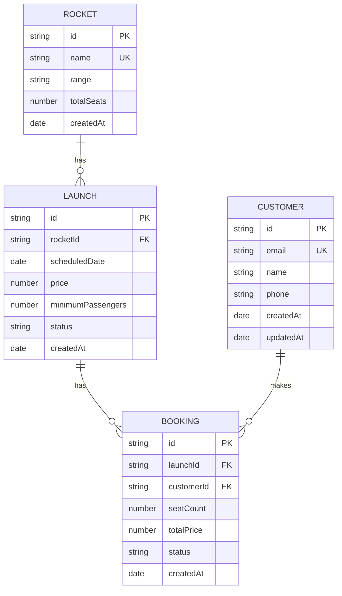

# AstroBookings Entity-Relationship Model

## Entities

### Rocket
- **id**: string (UUID)
- **name**: string (unique)
- **range**: string (suborbital | orbital | moon | mars)
- **totalSeats**: number (1-10)
- **createdAt**: Date

**Rules:**
- Name must be unique across all rockets
- Total seats must be between 1 and 10
- Range must be one of the predefined values

### Launch
- **id**: string (UUID)
- **rocketId**: string (Foreign Key → Rocket)
- **scheduledDate**: Date
- **price**: number (> 0)
- **minimumPassengers**: number (≥ 1)
- **status**: string (scheduled | active | completed | suspended | cancelled)
- **createdAt**: Date

**Rules:**
- Scheduled date must be in the future
- Price must be positive
- Minimum passengers must not exceed rocket's total seats
- Status transitions follow defined lifecycle

### Customer
- **id**: string (UUID)
- **email**: string (unique, valid email format)
- **name**: string (2-100 characters)
- **phone**: string (international format, 8-20 characters)
- **createdAt**: Date
- **updatedAt**: Date

**Rules:**
- Email must be unique across all customers
- Email must follow valid format and is immutable
- Name must be non-empty and properly formatted
- Phone must follow international format
- Timestamps automatically managed

### Booking
- **id**: string (UUID)
- **launchId**: string (Foreign Key → Launch)
- **customerId**: string (Foreign Key → Customer)
- **seatCount**: number (≥ 1)
- **totalPrice**: number
- **status**: string (pending | confirmed | cancelled)
- **createdAt**: Date

**Rules:**
- Seat count must be at least 1
- Total price calculated from launch price × seat count
- Cannot exceed available seats on launch
- Status reflects booking lifecycle

## Relationships

## Implementation Notes

**Phase 1 - Completed:**
- Rocket entity with CRUD operations
- Launch entity with CRUD operations and lifecycle management

**Phase 2 - Completed:**
- Customer entity with registration and profile management

**Phase 3 - In Progress:**
- Booking entity with seat reservation and real-time availability tracking
- Payment status tracking (pending | completed | failed)

**Data Integrity Constraints:**
- Foreign keys link launches to rockets and bookings to launches/customers
- Email and name uniqueness constraints on Customer
- Rocket name uniqueness constraint
- Status transitions validated at service layer
- Availability calculations derived from capacity minus booked seats
