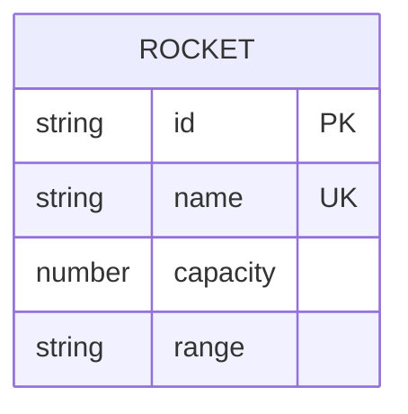

# Rockets Fleet Management 

## Problem definition

### User stories
- As an operator, I want to **register a rocket with its capacity and range of action** to enable its use in launch planning.
- As an operator, I want to **consult the rocket catalog** to quickly select a vehicle compatible with the destination.
- As an operator, I want to **update the operational data of a rocket** to maintain reliable information for business decisions.
- As an operator, I want to **decommission a rocket** to prevent its use in future launches.

### Business rules
- A rocket must have a name, capacity and range of action.
- A rocket must have a unique name.
- A rocket must have a capacity between 1 and 9.
- A rocket must have a range of action between Earth, Moon and Mars.

## Solution overview
### Data Model

### Backend API
- An endpoint to create a rocket with its capacity and range of action.
- An endpoint to consult the rocket catalog.
- An endpoint to update the operational data of a rocket.
- An endpoint to decommission a rocket.

### Frontend Application
- A form to register a new rocket with its capacity and range of action.
- A view to consult the rocket catalog.
- A form to update the operational data of a rocket.
- A button to decommission a rocket.
  
## Verification

### Acceptance criteria
- [ ] IF a new rocket is registered with valid data, THEN it should be added to the catalog.
- [ ] IF the rocket catalog is consulted, THEN it should display all registered rockets.
- [ ] IF a rocket's operational data is updated, THEN the changes should be reflected in the catalog.
- [ ] IF a rocket is decommissioned, THEN it should no longer be available for future launches.
- [ ] WHEN invalid data is provided, THEN the system should return appropriate error messages.
- [ ] WHEN a rocket is not found by its ID, THEN the system should return a not found error.