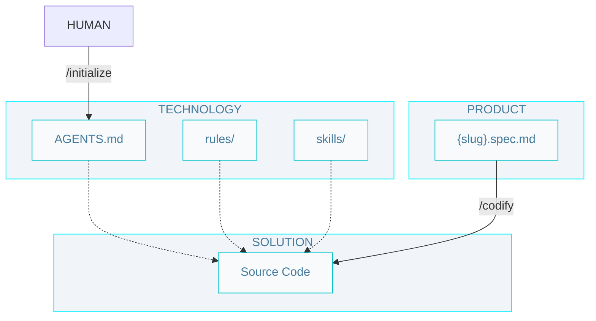

# Level 2 SDD workflow

## Commands

- `/initialize` - Create initial technology documentation (/AGENTS.md and skills/) for a project.

- `/codify` - Writes the code and unit tests following a plan, implementing a specification, or a minor requirement.

## Artifacts

### Technology

- `/AGENTS.md` - The entry point for any agent joining the project; defines how agents should operate, including rules, workflows, and artifact conventions.

- `rules/` - Define rules that agents must follow when writing code.

- `skills/` - Teach your agent how to do things. Make them easy to know when to use.

### Product

- `{slug}.spec.md` - A detailed specification (problem, solution, verification) of a feature or technical requirement.
  
### Solution

- `Source Code` - The implementation of the system, including unit tests.
