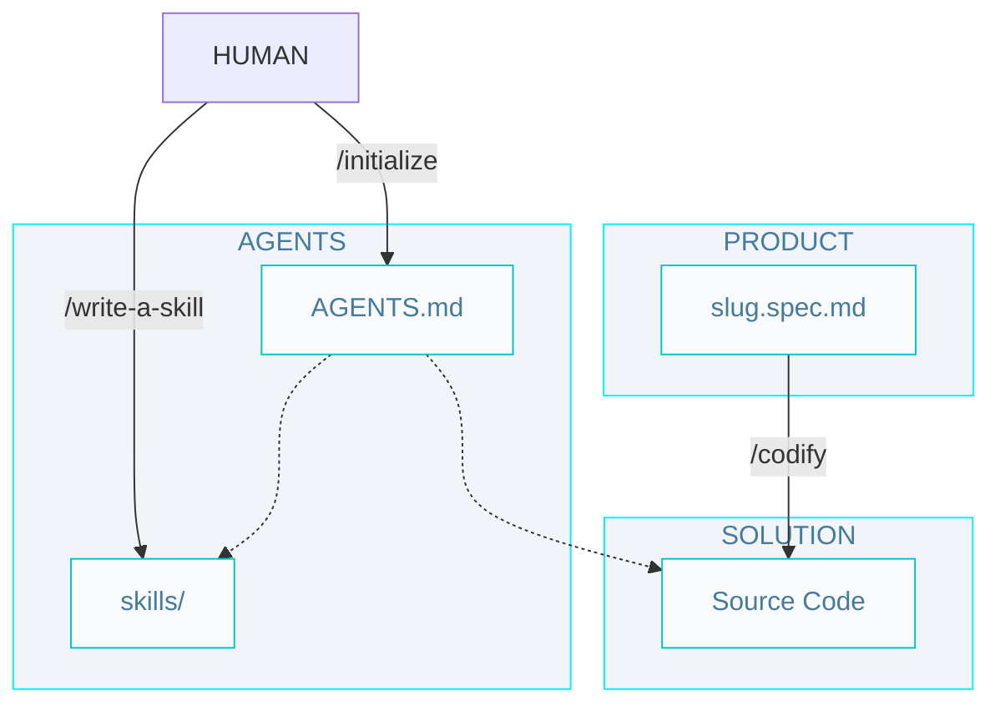

# Level 2 SDD workflow

## Commands

- `/initialize` - Create initial technology documentation (/AGENTS.md and skills/) for a project.

- `/write-a-skill` - Create a new skill from a human need (Can be a rule set, a workflow, or a utility command).

- `/codify` - Run the implementation cycle for one specification: generate plans, produce code, and validate with tests.

## Artifacts

- `/AGENTS.md` - The entry point for any agent joining the project; defines how agents should operate, including rules, workflows, and artifact conventions.

- `skills/` - Teach your agent how to do things. Make them easy to know when to use.

- `spec-slug.spec` - A detailed specification (problem, solution, verification) of a feature or technical requirement.
  
- `Source Code` - The implementation of the system, including unit tests.
