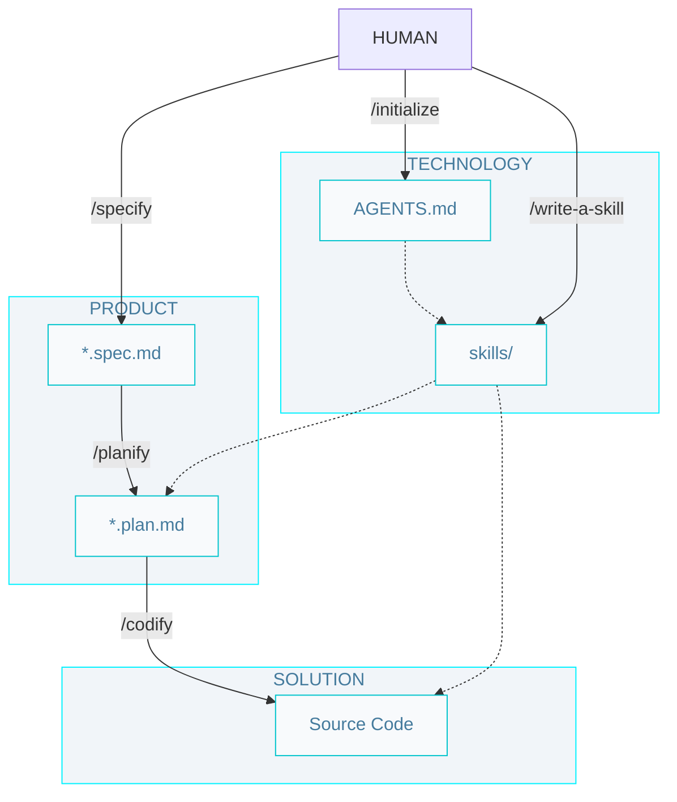

# Level 3 SDD workflow

## Commands

- `/initialize` - Create initial technology documentation (/AGENTS.md and skills/) for a project.

- `/specify` - Create a new specification from a requirement (defines problem, solution, and verification).

- `/planify` - Create a set of implementation plans for an specification (back, front and data)

- `/codify` - Run the implementation cycle for one specification: generate plans, produce code, and validate with tests.

## Artifacts

- `/AGENTS.md` - The entry point for any agent joining the project; defines how agents should operate, including rules, workflows, and artifact conventions.

- `skills/` - Teach your agent how to do things. Make them easy to know when to use.

- `specs/spec-slug.spec` - The source of truth for system behavior; a directory of detailed specifications (problem, solution, verification), one per feature or bug.

- `spec-slug.*.plan` - A set of implementation plans derived from a single specification, defining ordered steps and tasks for each tier.

- `Source Code` - The implementation of the system, including unit tests.
